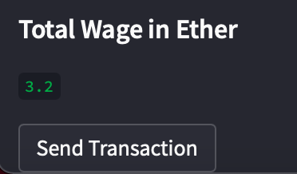
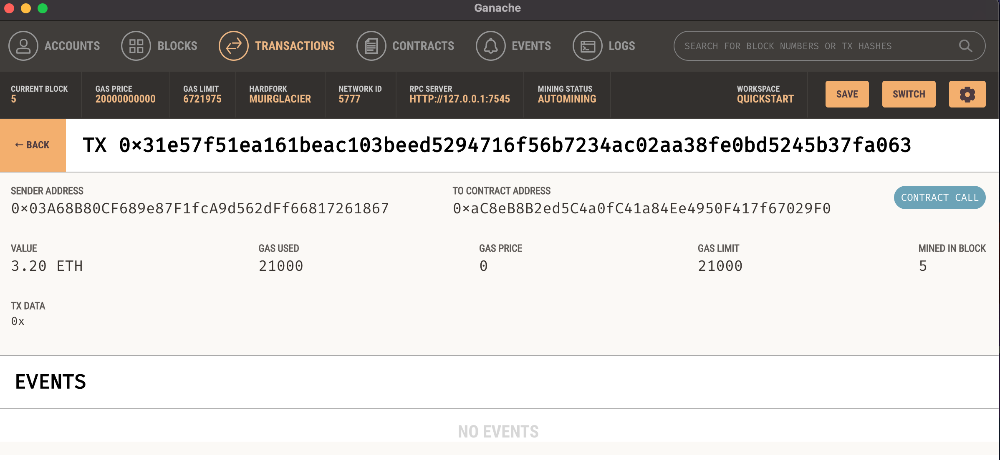

## Cryptocurrency Wallet

### Background

Fintech Finder is an application that its customers can use to find fintech professionals from among a list of candidates, hire them, and pay them. As Fintech Finder’s lead developer, you have been tasked with integrating the Ethereum blockchain network into the application in order to enable your customers to instantly pay the fintech professionals whom they hire with cryptocurrency.

In this project, I have compiled code that enables your customers to send cryptocurrency payments to fintech professionals.

### Application

To start off you select the employee you want to pay. Each employee comes with a rating and an hourly rate per eth.

On the side bar you select which employee you want to pay and how many hourse you are paying them for and below will be displayed their name, hourly rate and ethereum address.

Once all the data is filled in the side bar will display the total eth needed to pay the employee. Once the send transaction button is pressed the eth will leave the users wallet and the transaction will be made into the emlpoyee's wallet.

# Original amount

# Current amount

from the transaction there is exactly a decrease in 3.2 eth from the users wallet showing that there has been a transaction in money

Looking at ganache we can see that the eth has been transfered to the employee as the addresses match and the amount of eth being transfered also matches.

